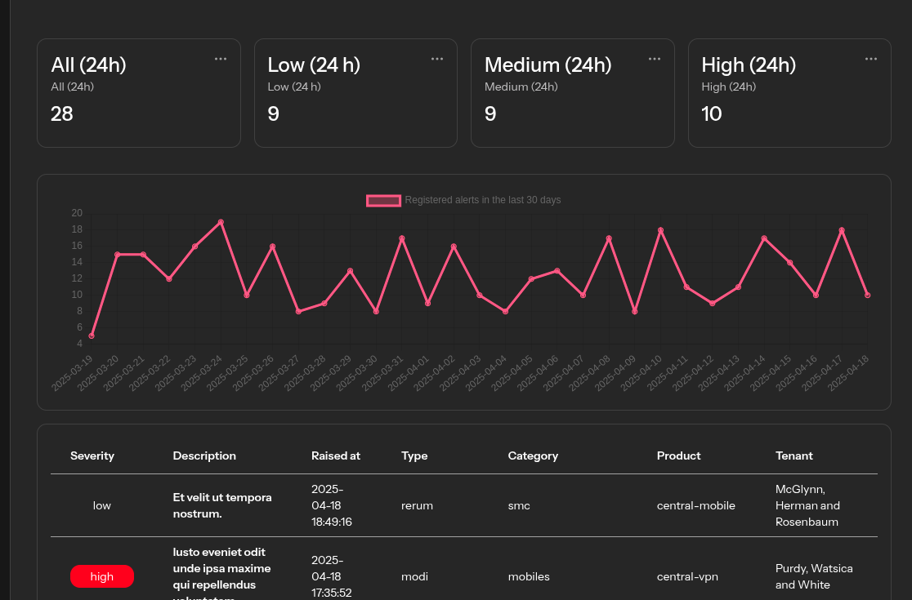
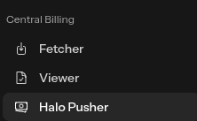

# ISCPP - Improved Sophos Central Partner Center

This project aims to leverage the Sophos Central API to develop a tool that addresses some missing features that could benefit MSPs. 
Additionally, it seeks to integrate with PSA systems to enhance billing processes.

[You ask why](https://github.com/xasz/ISCPP/wiki)

This is software is still in alpha, but have passed some first live tests.
Thanks to the testers and there feedback.

I understand there is still much work to be done, but I wanted to release ISCPP to allow users to start benefiting from its features and provide valuable feedback. Your input will help shape the future of this project and ensure it meets the needs of its users effectively.

## Fast overview over alle tenants

## Webhooks for Sophos Central Alerts

## Sophos Central Billing Integration for Halo

## Overall Tenant Health Reporting

## Alot more

- Sophos Health Overview
- Billing Overview
- NinjaOne Integration
- Massschedule Tools
- a lot planned

This project is a personal endeavor, and while I strive to ensure the application is secure and reliable to the best of my abilities and knowledge, I cannot accept liability for any misuse or issues that may arise.

## Roadmap
https://github.com/users/xasz/projects/1
# Installation

Look here: https://github.com/xasz/ISCPP/wiki/1.-Installation

> I am currently not able to host instances for you, but you will set this up in minutes.

# Need Help - Sure

Join the really new discord server.

https://discord.gg/GqTMtdMY

