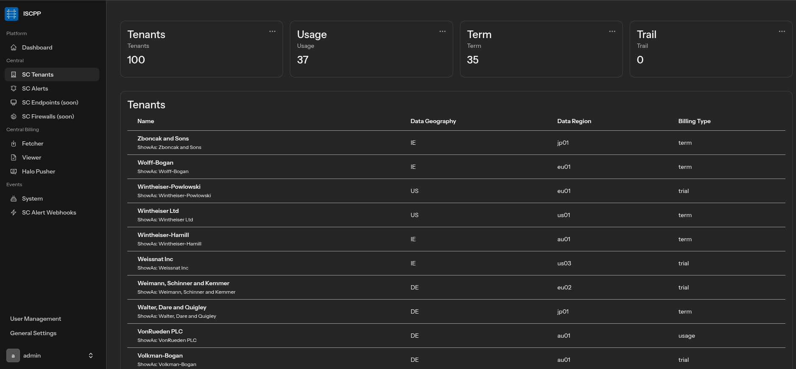
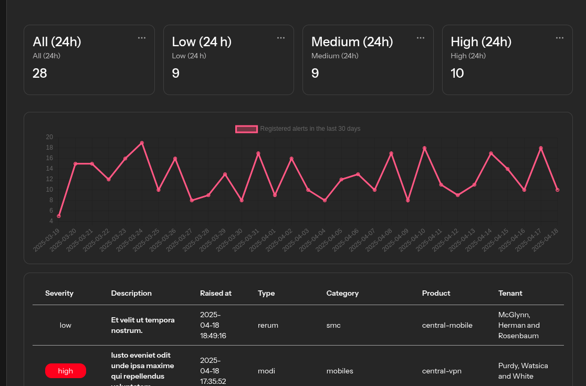
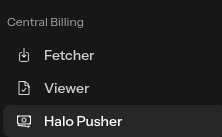

# ISCPP

ISCPP (Improve Sophos Central Partner Package) operations platform for MSPs that use Sophos Central.

It helps teams manage multiple tenants from one place, automate recurring operational tasks, and integrate Sophos data into PSA workflows.

## Why ISCPP

Sophos Central is powerful, but MSP workflows often require cross-tenant visibility and automation that are not available out of the box.

ISCPP focuses on those gaps by combining:

- Cross-tenant monitoring and search
- Alert forwarding and webhook workflows
- Billing-related data exports and integrations
- Firewall upgrade planning support
- Centralized health score reporting

More background: [Project Wiki](https://github.com/xasz/ISCPP/wiki)

## Core Features

- **Multi-tenant overview** dashboard
- **Search endpoints** across all Sophos Central tenants
- Sophos Central **alert forwarding** via webhooks
- **Halo PSA** billing integration
- **NinjaOne** endpoint deployment support
- F**irewall** upgrade planning
- Tenant **health score** reporting

## Screenshots

### Tenant Overview



### Alert Webhooks



### Halo Billing Integration



### Firewall Upgrade Planning


### Health and Design Preview


## Quick Start

```bash
git clone https://github.com/xasz/iscpp-docker
docker `compose up -d'
```

## Installation Guide

Detailed installation steps are available in the wiki:
[Installation Guide](https://github.com/xasz/ISCPP/wiki/1.-Installation)

## Project Status

ISCPP is currently in alpha. It is already used in early live environments, and active feedback is shaping upcoming releases.

## Support

- Discord: https://discord.gg/GqTMtdMY
- Issues: https://github.com/xasz/ISCPP/issues

## Disclaimer

This project is provided as-is. While care is taken to build secure and reliable functionality, you are responsible for validating suitability, security, and compliance in your own environment.

